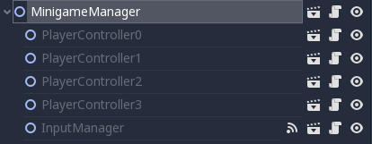
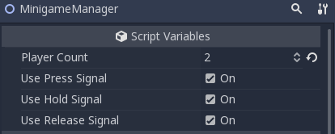
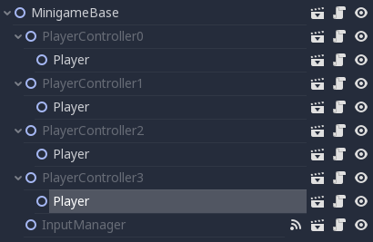

Quickstart
==========

1. Inherit from base scene.
---------------------------

All minigames have to inherit from the base minigame scene.

.. ::

In order to inherit from it click
	``Scene/New Inherited Scene``
Then navigate to the base scene located at
	``Minigames/Base/Minigame_Base.tscn``

The resulting hierarchy looks like this:

The `MinigameManager`_ is used for connecting different components to each other and overseeing the execution of the minigame.

.. _MinigameManager: documentation/minigame_manager.html

The `InputManager`_ is used for handling input from the buttons.

.. _InputManager: documentation/input_manager.html

Every `PlayerController`_ represents a possible player.

.. _PlayerController: documentation/player_controller.html

2. Setup the minigame
----------------------------------------------------------------------

Setup the number of players in the MinigameManager and signals caught by input manager.

Create a new scene for the player and add it under all the player controllers.

.. container:: warning

	Players have to be named 'Player'. Otherwise it will not work!

Depending on the signals chosen you have to implement these functions in your player script:

.. code::

	func press_action():
		print("Press!")

.. code::

	func hold_action(delta):
		print("Hold with delta %s!" % delta)

.. code::

	func release_action():
		print("Release!")